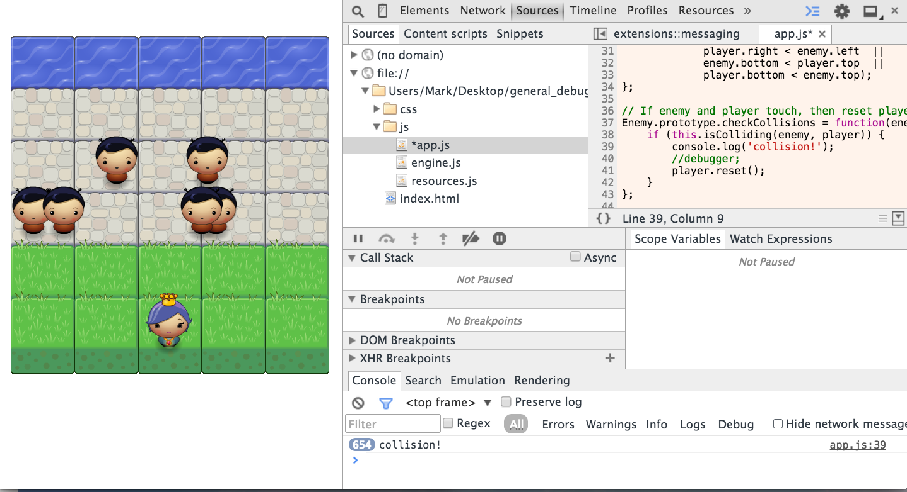
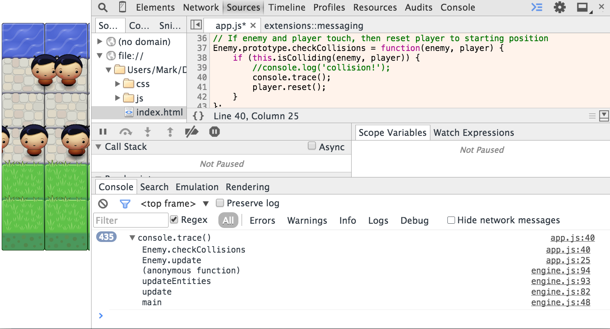
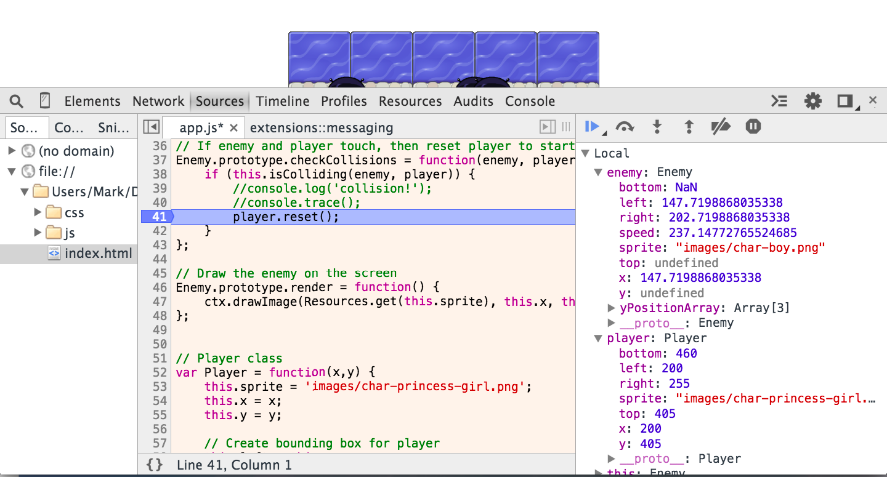

# Basic Debugging With Chrome Dev Tools

## Link to Office Hours

Here is the link to the actual office hours [session](https://plus.google.com/u/0/events/cnol83cpan170apb933pvmlts94?authkey=CJaD8fvjs_2OSg)

This demo shows how a person would

  - Use Chrome Dev Tools to trouble shoot any project
  - Understand the concepts of breakpoints and the call stack

### The Problem

The collisions for Project 3 (Frogger Game) does not work well. Occassionally, the player character resets itself without ever colliding with any other object. For simplicity's sake, we are 100% already certain that our actual collision function works because we've already done extensive testing of the algorithm.

This means that there must be other operations in our code that is affecting the calculations in our collision function.

###Step 1 - `console.log`

In order to confirm our suspicions we always should use console.log() in Chrome Dev Tools. To access Chrome Dev Tools, we need to go to Chrome's Menu and Click Tools -> Developer Tools

Go to the 'Sources' tab and find our function where we expect the function breaks. We add in `console.log('collision!');` in the collision function to make sure that there is an error and save the file with Command-S or Ctrl-S.

###Step 2 - Call the Stack Trace

We know need to need know what other calculations occurred before we call the `checkCollisions` function: this is called the stack and we want to trace this stack so therefore we need to call a stack trace to see what other functions were called before our `checkCollisions` function.

Therefore we use `console.trace`

As you can see, before we call our function `Enemy.checkCollisions`, we called these functions: `Enemy.update, an anonymous function, updateEntities, update, main`. `main` was the first function that we called and this function kicks off all of our other function calls.

Therefore we can understand that the program updates the enemy positions and then updates whether their new positions collide with the player character.

###Step 3 - Setting a Breakpoint

Breakpoints are points in the code where we tell our program to stop all execution of a code once it reaches that particular line in code. The advantage of using breakpoints is that at the point of break, the Browser will show us at that exact moment in the code what the entire state of the program is **including all the values for all variables** we defined.

To set a break point in Chrome Dev Tools, we go to our Sources tab and go to the source file such as `app.js` and left-click on the actual number of the line that we want to break.

In the image below, we clicked on the actual number 41 to tell Chrome to stop execution at line 41 and Chrome will highlight our breakpoint by highlighting the line in blue.

###Step 4 - Analyze local variables

We then focus on the local variables that occur on breakpoints. For each breakpoint, we get a snapshot of what is actually happening at that very moment in the code.

We find that the variales `bottom, top, and y` are not appropriate for the enemy character. These variables are actually very crucial to the collision function algorithm which depends on these variables to be an actual number at any point in the program execution.

###Step 5 - Follow the stack trace

We follow the stack trace and find out that variables `bottom, top, and y` are assigned in the `enemy.update` function by this assignment:

`this.y = this.yPositionArray[Math.round(Math.random() * this.yPositionArray.length)];`

It looks like this code is calculating a random number between 0 and the length of the array: `yPositionArray`, round up the number and then use that number to get an element in `yPositionArray`. Therefore for every call of this line, we would get a random index between 0 through 2 to get a y position for the enemy from `yPositionArray`.

###Step 6 - Unpack the variable assignments

We unpack this variable assignment and console.log() these variables. Upon close inspection, we see that 

`Math.round(Math.rand() * this.yPositionArray.length)` will occassionally give us the number 3 which will lead to `undefined` when we try to access `yPositionArray[3]` because 3 is out of bounds for `yPositionArray` - *This is the source of the bug!*

To fix this bug, we instead use Math.floor() instead of Math.round() to truncate the decimal, guaranteeing us a random number in the range from 0 to 2.

###Conclusion

We often would `console.log` and set breakpoints to get snapshots of the code at any given point in time. The stack trace is crucial for us because we at any given time, we know exactly how our bug has been created by understanding the specific function execution order that caused the bug.

**References:**

A full reference to debugging in Chrome Dev Tools can be found [here](https://developer.chrome.com/devtools/docs/javascript-debugging)

Defintion of the `undefined` primitive in JavaScript can be found [here](https://developer.mozilla.org/en-US/docs/Web/JavaScript/Reference/Global_Objects/undefined)