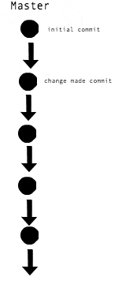
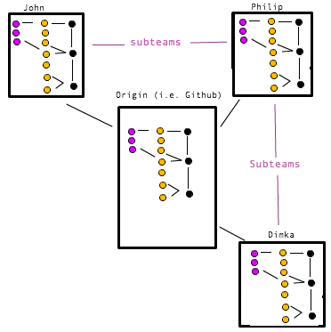
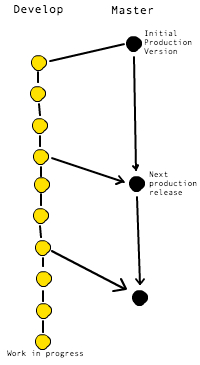
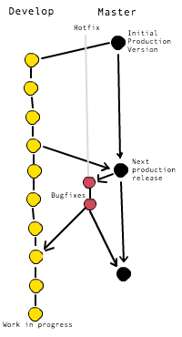
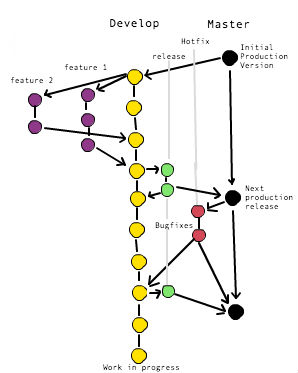

# Git Branching Strategies

## Office Hours Link

Link to the Office Hours: [Git Branching Strategies](https://plus.google.com/events/ca8c5vkrhg07lssbvomq2rjh2sg?authkey=CLW8xcGdl4TeNg)

##Introduction

Hello everyone, today we talked about common git workflows, in particular the common workflow known as Git Flow. Git workflows are standard at any company that has a front-end engineering team. Having a work flow and branching strategy allows teams to be more flexible, more organized, and work together easier.

You may be using a basic workflow now where you simply are doing all of the work on the master branch, and perhaps you create additional branches when you work on a small addition or feature.



This is a decent workflow when you are working by yourself or maybe with another person. However, a workflow like this will quickly become unwieldy and disorganized as the size of the people working on a project grows.

Since companies will tend to have a sizeable group of engineers working on a project it's good to establish a workflow and strategy for when changes are pushed and merged and having different working branched for different parts of the same project. Enter Git Flow an organizational model created by Vincent Driessen which is a great example of an organizational strategy many teams and companies use for the products.

##The Repository Structure
The first part of the git workflow is to have a clear understanding of the repository setup. We first have the origin which is our central repository. This repository contains all of our production and development code. Every developer pushes and pulls from this central repository befor and after releases. Developers also each have there own local repository and they can push and pull from a peers repo to form subteams. Subteams are good for when two or more developers are working on the same feature but don't necessarily want to add their work to the production code yet. Forming subteams is as simple as creating a git remote that points to a peers repository and vice-versa.



##Working in Branches

Everyone will have two primary branches, a master branch and a development branch. The master branch will always have a HEAD that reflects the production-ready state of your code, commits will be infrequent, and commits will commonly be tagged with a version number. Git has a pretty easy way to go about tagging commits with version numbers. Simply use the command git tag. Now many different companies use varying versioning rules but one of the most common is semantic versioning which you can read about [here](http://semver.org/).

The development branch runs parallel to the master branch and will always reflect a state with the latest delivered development changes for the next release. The development branch is where all of the finishes features teams are working on will be collected prior to a production release.



Supporting Branches
Using just a development and master branch is good but may cause issues with larger teams. Should every team be developing their features on the development branch? What happens if there's a minor bug in the production code? Should you go and fix the problem on the development branch? Is that a feature then? All of these questions are answered with additional support branches.

##Hotfix Branches

These branches are created and used for when a production releases and their is need for a fix in the production code. These branches often arise out of the necessity to act quickly. Hotfix branches typically branch from the master branch and merge back to both the master and develop branches.



##Feature Branches

These branches are used within subteams to begin development on distant future or upcoming features. These branches are where most of the day-to-day work will be happening as teams will create a new feature branch everytime they decide to work on something new. The great thing about feature branches is that they are removed from the development branches so if a feature fails you can just scrap the feature branch as opposed to having to make changes on your development branch. When these features are complete they get merged back into the development branch.

In some cases you may want to use the `--no-ff` tag when merge a feature back into the development branch. This usually arises when you've worked on a feature and no commits have occurred on the development branch. Instead of merging the feature and inserting it right into the development snapshot we will want to keep some of those commits off of the development branch, using --no-ff will give the desired effect.


##Release Branches
These branches are used in preparation for merging the development branch over to the master branch. The release branch is just an additional organizational layer and often times teams will run their tests against this branch prior to launch. The release branch is also a branch that allows everyone to make any quick changes prior to release so that hotfixes are not required.



##Wrapping up

Have a workflow similar to this model is great for teams of any size. While not every company may have an identical workflow to this one they should have one! Be sure to spend some time following this basic workflow and maybe consider incorporating it into your own practices 

##Undoing Things in Git

Since we have a little more time we also thought we'd spend a brief moment talking about how to undo things in git.

* **using --amend**
   * Why use it? 
    * You forget to commit a file or mess up the message
   * What it does? 
    * Lets you recommit while not adding a new commit to your repositories snapshot
   * How do you use it?
      
      ```
      git commit -m 'a commit message'
      git add forgotten_file
      git commit --amend
      ```
* **git reset**
   * Why use it?
    * You accidentally add files to the staging area you don’t want to commit
   * What it does?
    * Let’s you modify what is in the staging area.
   * How do you do it?
    
     ```
     git reset HEAD file-to-uncommit
     ```
* **git checkout filename**
   * Why use it?
    * You made changes to a file and now you want to remove those from your git snapshot
   * What it does?
    * Reverts the file back to a commit before the most recent one and deletes any history of that file in the commit history
   * How do you do it?
   
    ```
    git checkout file-to-rollback
    ```

If you are ever wondering what you should do in git be sure to checkout this [flowchart!](http://justinhileman.info/article/git-pretty/) 

