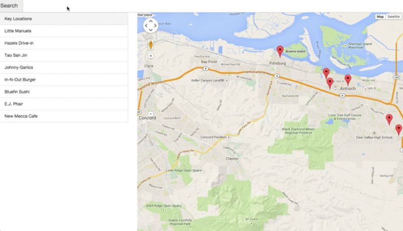
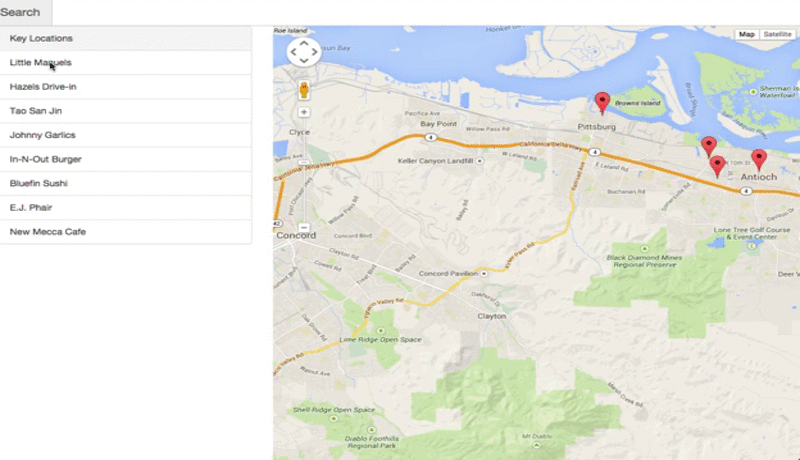

<h1>Office Hours Link</h1>

Link to the Office Hours: <a href="https://plus.google.com/u/0/events/cb3105iclo5391h3bfg805m9k3k?authkey=CKG-_pG1hN_cmwE">P5 and P6</a> 

<a href="../../Javascript Testing/P6 Overview/">Link to P6 Overview</a>
<h1><u>Project 5 Neighborhood Map Example<u></h1>

Let's talk a little bit about the basic functionality of our map! First and foremost we need to make sure we include the 3 main components A Search bar, a list view, and a map. Notice our map has markers and the list view contains the names of each of the locations on our map.

Now for basic functionality we need to make sure to that our search filters BOTH our list view and our map markers. We are only looking for a basic search functionality, so it only needs to be able to search by name. Feel free though to modify the filter to search for location type or other information. 

Along with our list and markers filtering based on our search bar, they should also both be clickable. When we click a list item it should move towards the marker and open an info window. Clicking on a marker should also open an info window. The content of the info window is up to you but it would be a good chance to include an API! Notice as well that our markers animate to draw our users attention to that marker. 

 

<h2><u>The Rubric</u></h2>
<h3>Interface Design</h3>
<i>All application components render on-screen in a responsive manner, usable across modern desktop, tablet, and phone browsers</i>

By this point in the Nanodegree you should be familiar with what it means for something to be responsive. The best way to begin making the interface responsive is that you design for mobile first. Build it small then make it big! If you have time take a look at the <a href="https://www.udacity.com/course/viewer#!/c-ud893-nd/l-3523969367/m-3551129148">Responsive Web Design Course</a> that we released that will teach you a lot of great ways to make things responsive. 

<h3>App Functionality</h3>
<i>All application components function appropriately without error.</i>

This is what is shown above, make sure that the search bar, list view, and map. If you do add additional components these also <b>must</b> function as well. Adding half-built additional functionality will lead to not meeting specifications.

<h3>App Architecture</h3>
<i>Code is properly separated based upon Knockout's best practices.</i>

Knockout is a bit of a shift in thinking. If you don't know where to start go through <a href="http://knockoutjs.com/documentation/introduction.html">Knockouts Documentation</a>, which reads like a series of articles. Follow along and build some of the basic examples from Knockout and try to apply them to your project. 

Really think about the Model-View-ViewModel paradigm. Remember that Google Maps API handles the View and the Model you are mostly taking of the ViewModel component. You never really touch the HTML code that takes care of the View. 

Finally be sure to think of infowindow's content as either a view or a model. The InfoWindow itself is the ViewModel. We need to separate concerns and make sure we make it easy for us to go back and set the content for the InfoWindow 

<h3>Asynchronous Data Usage</h3>
<i>Application utilizes Google's Map API and at least one additional third-party "data API". All data requests are retrieved in an asynchronous manner. In the event of a failed data retrieval errors are handled gracefully.</i>

So we require that you utilize Google's Map API. The main thing we want to point out here that you must make sure that if the data retrieval fails you indicate to the user that such a problem has occured. The user should not be left guessing why something is not working. To test the functionality of failed data requests you can simply disconnect from the internet.

<h2>API's We Recommend</h2>
<a href="http://www.yelp.com/developers/documentation">Yelp's API</a>
<a href="https://instagram.com/developer/">Instagram's API</a>
<a href="https://developer.foursquare.com/">Foursquare's API</a>
<a href="http://www.mediawiki.org/wiki/API:Main_page">Wikipedia's API</a>

<h2><u>Questions</u></h2>
<b>Can you elaborate on the search/filter functionality? should I be able to search by name of the place or something else as well?</b> 

To meet specifications the only functionality we are looking for that it filters by name. You can add additional functionality to the filter if you want for example utilizing search terms or being able to filter by star rating.

<b>The code I write to set up data for my Model such as load it from foursquare using getJSON(...) should it be inside my Model itself or in the ViewModel?</b>

Depends on where you think that data should go. If you think it makes sense as part of your Model put it there. If you think it makes more sense as part of the ViewModel put it their. Just stay consistent and make sure that you will be able to come back to the project in the future and easily know where things are located and whats going on.

<b>Any recommendations for APIs that require OAuth? Utilizing client-side JavaScript appears to be frowned upon for these instances.</b>

Check out <a href="http://oauth.net/code/">http://oauth.net/code/</a>. For a list OAuth library. I utilized Yelp API that just uses OAuth. Most others tend to be pretty simple. 

<b>I've run into several APIs that do not support CORS or JSONP. I'm guessing these are expected to be accessed by back-end systems, and our client-side scripts would access the data there. Do you have any recommendations for utilizing these at all?</b>

Besides trying to set up a back-end (i.e. using something like NodeJS). With JSONP it's a bit of a hack that goes around CORS. JSONP gives us the ability to get the response as a function. You send a JSONP request and you get the data back and that data gets called on an anonymous function. Really JSONP is a bit of a hack to get the raw data from a server. Assuming you're using JQuery with AJAX to make your JSONP request. 

<b>When I am hiding/displaying markers with marker.setMap(null)... is this following knockout best practices because even though I am not touching the DOM, I am also not using knockout observables etc..</b>

Not using an observable isn't going against knockout's best practices. Since the marker object is a part of Google Maps ViewModel and not necesarilly the one you are building you don't necessarily need to use knockout for that.

<b>What are your favorite APIs other than Google maps?</b>

We really like the yelp API, Last.fm API, Twitter's API, Instagrams API, Foursquares API. For other maps we haven't really tried any other mapping API's than googles API's. If there is a website you go to regularly look out for a developer or API link as most sites these days have these! 

<b>Does this mean using open street maps api is ok as well?</b> 

Not for this project we ask that you please use only the google maps API, but in your own project feel free to!
