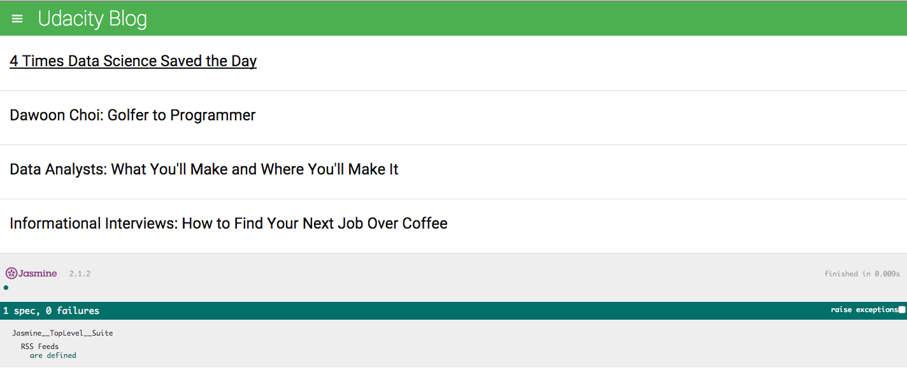

<h1>Office Hours Link</h1>

Link to the Office Hours: <a href="https://plus.google.com/u/0/events/cb3105iclo5391h3bfg805m9k3k?authkey=CKG-_pG1hN_cmwE">P5 and P6</a> 
<a href="../../Javascript Design Patterns/P5 Project Overview/">Link to P5 Overview</a>
<h1>Project 6 The Feedreader Testing with Jasmine</h1>
This project is all about writing tests using Jasmine to make sure a udacity blog RSS feed works correctly. 

When you download the project and open the index.html file you should see the following. At the bottom you'll notice the Jasmine debug dialog along with the status of the test cases that have run. If you navigate in your project directory to jasmine/spec/ you'll see a feedreader.js file. This is where you will be doing all of the work for this project. 

Now a good way to make sure your tests are working is to try and break them. For example the included test in our project checks that our RSS feed has information! So if we open up the app.js file in our js folder and delete the RSS feed data, we should see our test case fail!

After you've read the feedreader.js file we recommend you dive into <a href="http://jasmine.github.io/2.2/introduction.html">Jasmines Documentation</a>. Again work through Jasmines Documentation and be sure to read the comments through out it as a lot of explanation is included there. 

<h2><u>The Rubric</u></h2>

<b>Test Coverage</b>
<i>The required tests for the project are all provided and are comprehensive enough to adequately test the functionality</i>

Make sure to implement all of the TODO's in the feedreader.js file that's mostly what we are looking for! 

<b>Test Results</b>
<i>All required test for the project pass</i>

Again make sure you follow all the TODO directions!

<b>Exceeding Specifications</b>
You can add tests that will test for future unimplemented functionality, but please document what the test is looking for, what the new functionality will be, and a sentence on how you might implement it. 

<h2><u>Questions</u></h2>

<b>How can one make sure Jasmine is using the right variables? I ran my code with 'feed.url' and Jasmine worked, but when I substituted it with 'test', it still worked! There is no variable or object called test. I am not sure what is going on.</b>

We'll have to see your code, but from what you've described some error should have been thrown. 

<b>What do you think of using Karma with Jasmine?</b>
Totally yeah, you won't have to do that for this project but you should begin looking into this as it will make testing very streamlined!
