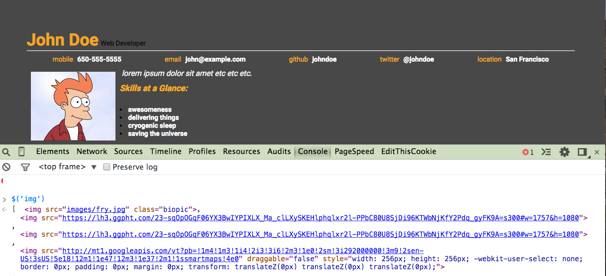
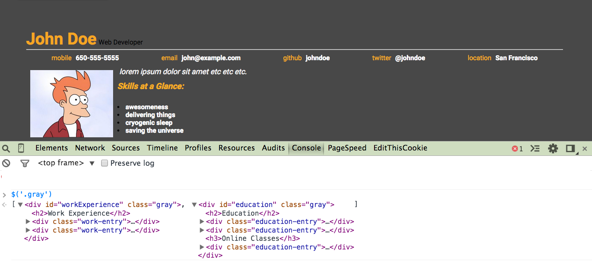
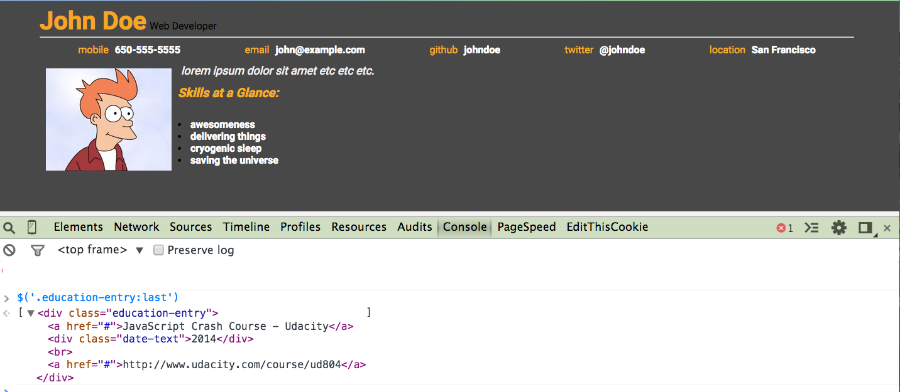

# Learning jQuery

## Office Hours Link

Link to the Office Hours by Mark and Poornima on 02/09/2015: [jQuery Office Hours](https://plus.google.com/events/ci8p7kqm6od3p07obpopo69tc1c?authkey=CK-JiYiKvu_8mwE)

## Introduction

To get the most out of jQuery, let's review the **DOM - Document Object Model**
* A HTML document is structured according to the DOM
* jQuery can access HTML by interacting with DOM
* DOM consists of every element on the page laid out hierarchically (in other words, it reflects the way the HTML document is ordered)
* The DOM tree is the representation of the HTML document in the form of a tree having parents, children and siblings.

Here is a basic HTML document:

```
<!DOCTYPE html>
<html>
	<head>
		<title>The title</title>
	</head>
	<body>
		The body
	</body>
</html>
```

The DOM tree for the above HTML document looks like this:


Let us talk about jQuery now:
* jQuery is **not** a programming language
* It is a library or a set of helpful add-ons to the JavaScript programming language
* It helps with manipulating HTML elements and helps build websites faster
* The jQuery library contains a jQuery function which lets you select elements

## Adding jQuery into your project

* Linking locally using your own server
```
<script src='js/jquery.min.js'></script>
```
* jQuery Official
```
<script src='https://code.jquery.com/jquery-1.11.1.min.js'><script>
```
* jQuery hosted on a Content Delivery Network(CDN) - **Recommended**
```
<script src='https://ajax.googleapis.com/ajax/libs/jquery/1.11.2/jquery.min.js'></script>
```

<p> Let us consider loading the mockup version of the Interactive Resume that I populated in the web browser. Now, we can use the jQuery function (on Developers Console in Chrome) to look at the DOM elements in the HTML document. (We mainly focus on the contents of index.html and helper.js files)</p>

The **$** character is the pointer to the same jQuery function/object (since functions are also objects in JavaScript)


<p> jQuery returns an array like object that looks and behaves like an array but includes additional methods. </p>
* You could pass in strings into the jQuery object and a jQuery collection of DOM elements will be returned.
* You could pass in functions inside the jQuery function as well.
* You can pass a DOM element, a class, an id or a css selector into the jQuery

<h2>Passing a DOM Element</h2>


<h2>Passing a Class</h2>


<h2>Passing an ID</h2>


<h2>Passing a CSS Selector</h2>


## The Importance of $(document).ready();

* document - Refers to the entire HTML document
* ready() - is a  function that says: "Do some action once the HTML document is ready"
* This action that the ready function works on can be user defined and is a jQuery event that occurs as soon as the HTML document ready. Here is an example:
```
$(document).ready(function() {
  $('button').click(function() {
    //do something 
  });
})
```
This example defines a function that is triggered when a click event occurs on the element 'button'. This event takes place only when the document is loaded and the DOM elements are ready.

## jQuery Chaining

With jQuery you can chain together action/methods
```
$('#h1').css("color", "red").slideUp(2000).slideDown(2000);
```
Helps to run multiple jQuery commands, one after another, on the same element.
(Full code given in jQuery_Chaining.html)

## Additional Demo

jQuery Searching in DOM - jQuery makes finding elements from the DOM tree easier
```
<!--Using jQuery instead of looping through all the elements in the HTML document 
to find text inside the div-->
$( 'div:contains("John")' ).css( 'color', 'blue' );
```
Example given in jQuery_SearchingInDOM.html
